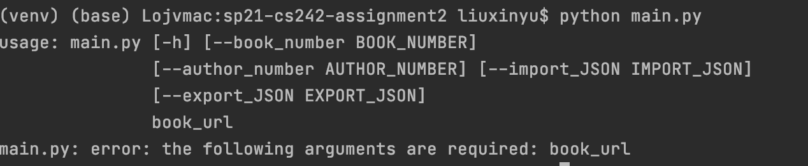
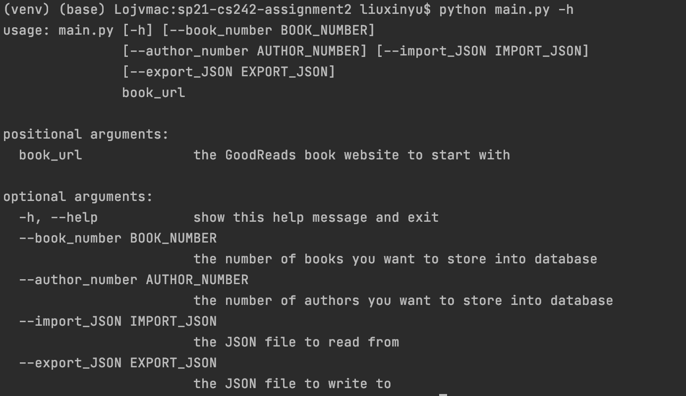

Manual Test Plan
==========

A Manual test plan including screenshots and the corresponding error and process.

Table of Contents
-----------------

  * [Prerequisites](#Prerequisites)
  * [Environment Setup and Configurations](#Environment)
  * [Error messages](#Errors and Process)
  * [Command Line Interface](#Command Line Interface)
  * [Scraping process](#Scraping process)

Prerequisites
------------

The application requires the following to run:
  * A Python development environment [PyCharm] or [PyDev for Eclipse]

Environment
------------

1. clone the repository to local filesystem -- git clone https://gitlab.engr.illinois.edu/xinyu6/sp21-cs242-assignment2.git \
2. Open an IDE written in Python, such as PyCharm or PyDev for Eclipse, run the main.py file

Errors and Process
------------

If a book doesn't have a ISBN number, this error will appear: \

If the number of authors meet the requirement, this warning will appear:\

If the number of books meet the requirement, this warning will appear:\

Command Line Interface
-------
This is the Command Line Interface if you just type "python main.py" in the terminal without any arguments:

Then if you type "python main.py -h" in the terminal, which give users explanations about the argument:

If a user gave an invalid url, this will appear:

Scraping process
-------

This is the scraping progress and errors showing when the scraper is running:

At the end, if users specify the output json file, this appears:

And the according JSON file will be like this:

The database stored after scraping is:

[PyCharm]: https://www.jetbrains.com/pycharm/
[PyDev for Eclipse]: https://www.pydev.org/