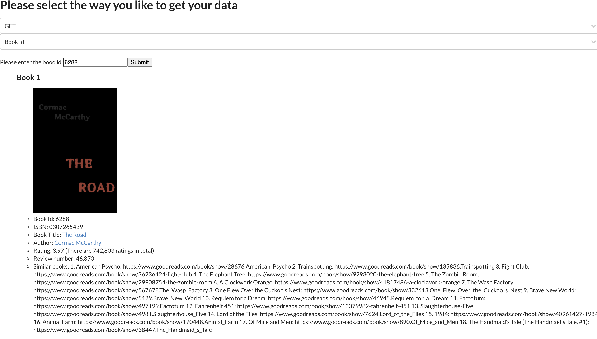
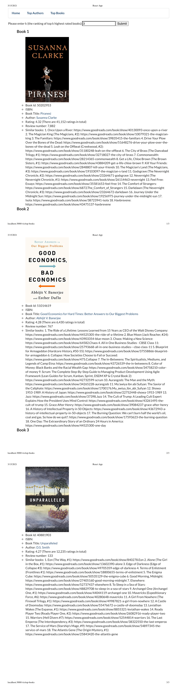

Manual Test Plan
==========

A Manual test plan including screenshots and the corresponding error and process.

Table of Contents
-----------------

  * [Prerequisites](#Prerequisites)
  * [Environment Setup and Configurations](#Environment)
  * [Error messages](#errors-and-process)
  * [Command Line Interface](#command-line-interface)
  * [Scraping process](#scraping-process)
  * [React Application](#react-application)

Prerequisites
------------

The application requires the following to run:
  * A Python development environment [PyCharm] or [PyDev for Eclipse]
  * Single-page application using frameworks like React

Environment
------------

1. clone the repository to local filesystem -- git clone https://gitlab.engr.illinois.edu/xinyu6/sp21-cs242-assignment2.git \
2. Open an IDE written in Python, such as PyCharm or PyDev for Eclipse, run the main.py file

Errors and Process
------------

If a book doesn't have a ISBN number, this error will appear: \

If the number of authors meet the requirement, this warning will appear:\

If the number of books meet the requirement, this warning will appear:\

Command Line Interface
-------
This is the Command Line Interface if you just type "python main.py" in the terminal without any arguments:

Then if you type "python main.py -h" in the terminal, which give users explanations about the argument:

If a user gave an invalid url, this will appear:

Scraping process
-------

This is the scraping progress and errors showing when the scraper is running:

At the end, if users specify the output json file, this appears:

And the according JSON file will be like this:

The database stored after scraping is:

React Application
-------

This is the main page when you start the react application where you can select the menu at the top and the API request type:

The request selector has the following value:

There are 4 different types of API requests:
1. if the chosen request is PUT, you will get another selector showing below where you can select whether you want to update book or author:

   Take book as an example, after choosing "Book Id", an input field will show up like following where you can type the book id:
   
   Then, after a valid book id is entered and click submit, a notification of success will show up:
   
   And then an input group will show up where each field contains the information of the selected book:
   
   After changing the field and click "Update" button, this message will show up and the database will be updated accordingly.
   
   
2. if the chosen request is GET, you will get another selector showing below where you can select whether you want to update book or author:

   Take book as an example, after choosing "Book Id", an input field will show up like following where you can type the book id:
   
   Then, after a valid book id is entered and click submit, a notification of success will show up:
   
   And then the information of the book matched the input field will show up:
   

3. if the chosen request is POST, you will get another selector showing below where you can select whether you want to update book or author:
   
   If you choose "Book", an input group will show up where you can type the information of the book you want to create:
   
   If you choose "Author", another input group will show up where you can type the information of the author you want to create:
   
   After filling out the fields and click "Submit" button, this message will show up and the database will be updated accordingly.
   
   
4. if the chosen request is DELETE, you will get another selector showing below where you can select whether you want to update book or author:
   
   Take book as an example, after choosing "Book Id", an input field will show up like following where you can type the book id:
   
   Then, after a valid book id is entered and click submit, a notification of success will show up and the book will be deleted from the database:
   

Users can also choose "Top Books" and "Top Authors" on the top menu. 
If you click "Top Books", this is the page you will see after you click it:

You can specify the top k highest rating books in the input field, e.g. if you enter 3, the top 3 highest rating books will show up:

Same works for "Top Author". If you click "Top Books", this is the page you will see after you click it:

You can specify the top k highest rating authors in the input field, e.g. if you enter 2, the top 2 highest rating authors will show up:

[PyCharm]: https://www.jetbrains.com/pycharm/
[PyDev for Eclipse]: https://www.pydev.org/